# MULTIVARIATE REGRESSION ON REAL ESTATE PRICE PREDICTION

## Context

A local Vermont/New Hampshire real estate firm is looking into modeling closed prices for houses. This dataset contains features of houses in three towns in Vermont, which make up a sizable chunk of the real estate firm's business.

## Hypothesis

Is it possible to predict a closing price of a property in Vermont/New Hampshire with machine learning algorithm? If so, how accurate can it be?

## Data
| Training Data       | Testing Data           | Validating Data  |
| :-------------: |:-------------:| :-----:|
| train.csv      | test.csv | validate.csv |

* Data was obtained from Kaggle.com
  * This dataset contains features of houses in three towns in Vermont,
which make up a sizable chunk of the real estate firm's business.
  * MLS.com is the real estate information platform that is publicly available. Features were exported from an MLS web platform. (Perhaps webscraping)

## Features:
* `id` : Numeric
* `bedrooms_total` : Numeric
* `baths_total` : Numeric
* `acres` : Numeric
* `sq_ft_tot_fn` : Numeric
* `tax_gross_amount` : Numeric
* `assessment_value_town` : Numeric
* `garage_capacity` : Numeric
* `address` : String
* `city` : String
* `garage_type` : String
* `year_built` : Numeric
* `total_stories` : Numeric
* `surveyed` : String
* `seasonal` : String
* `water_body_type` : String
* `water_frontage_length` : Numeric
* `short_sale` : String
* `rooms_total` : Numeric
* `garage` : String
* `flood_zone` : String
* `easements` : String
* `current_use` : String
* `covenants` : String
* `common_land_acres` : String
* `basement_access_type` : String
* `basement` : String
* `price_closed`: String

## Technology
* Jupyter Notebook
* Python

## Python libraries
* scikit-learn (for topic modeling)
* pandas (for data science)
* numpy (for general numerics and linear algebra)
* MLxtend (for stacking regression)
* Seaborn, Plotly (for visualization)
* TensorFlow,Contrib.Learn(for neural network analysis)

## Data Munging and Exploration

* First, the dataframe is queried for null values using `df.isnull().sum().sort_values(ascending=False)`

* Null values are then visualized using a heatmap `sns.heatmap(df.isnull(),yticklabels=False,cbar=False,cmap='viridis')`


* Since the data sample is small, I have decided to drop columns that have null values more than 60% such as
  * common_land_acres
  * water_frontage_length
  * easements
  * water_body_type


* Thus, Dataframe is first munged using `df = df.drop(['common_land_acres','water_frontage_length','easements','water_body_type'],axis=1)`

* For some other columns, I have decided to fill in the missing values with the mean of those columns iteratively


```python
for col in ['acres','garage_capacity','tax_gross_amount','assessment_value_town']:
  df[col] = df[col].fillna(df[col].mean())
```

* For column that have only a few missing values, I use my best judgement to fill in values that could potentially help to create a reasonable values and will not affect the distribution. Mapping to a dictionary was used in some cases
   * `df['basement'] = df['basement'].fillna('No')`
   * `df['flood_zone']= df['flood_zone'].map({'No':0,'Yes':1,'Unknown':1})`
   * `df['current_use']= df['current_use'].map({'No':0,'Yes':1,'Unknown':1})`
   * `df['basement']= df['basement'].map({'No':0,'Yes':1})`
   * `df['garage']= df['garage'].map({'No':0,'Yes':1})`

* At this stage, some dummies column values are generated as part of exploratory feature engineering
  * `city = pd.get_dummies(df.city,prefix='city_',drop_first=True)`
  * `covenants = pd.get_dummies(df.covenants,prefix='covenants_',drop_first=True)`

## Visualization: Exploratory Data Analysis
* Methods such as `info()` and `describe` are called on the dataframe for analysis
* A visualiztion of the closing price distribution is necessary to shape our methodology. It is normally distributed with a long tail
 
* We can also see a clear distinction between closing prices differe by number of bedrooms and bathrooms
  
  
* Perhaps the bedroom price is also different based on the fact whether or not a property has a garage?
  
* A scatter matrix is created with Seaborn to visualize the relationship within all existing features:
 
* Upon inspection, we can see some clear linear features. Re-visualize them with Seaborn and focus on the *'Closing Price'* row
 
 * We also take a look at the relationships that are not linear:
  
* A Seaborn heatmap is neccessary to show the correlation between features
  

## Simple Linear Regression
* Firstly, I attempted to train the model on the testing dataset using train_test_split

```python
X = df[['bedrooms_total', 'baths_total', 'acres',    'sq_ft_tot_fn','tax_gross_amount', 'assessment_value_town', 'garage_capacity','year_built', 'total_stories',
'rooms_total', 'garage','flood_zone','basement', 'price_closed', 'city__Pomfret', 'city__Woodstock',
'covenants__Unknown', 'covenants__Yes']]
y = df['price_closed']
```

* A simple linear regression model is intialized and trained

```python
X_train,X_test,y_train,y_test= train_test_split(X,y,test_size=0.2,random_state=101)
from sklearn.linear_model import LinearRegression
lm = LinearRegression()
lm.fit(X_train,y_train)
```

* Metrics such as mean absolute errors, mean squared errors and root mean squared errors are used to evaluate this first run:
  * MAE: 314120.6155993199
  * MSE: 262121390014.01596
  * RMSE: 511977.9194594392

* The coefficients value of each features are also generated for evaluation

```python
df=pd.DataFrame(lm.coef_,X.columns,columns=['Coefficient'])
```


* The accuracy of the model is then cross-evaluated with the null accuracy of the model itself

```python
y_null = np.zeros_like(y_test, dtype=float)
y_null.fill(y_test.mean())
np.sqrt(metrics.mean_squared_error(y_test, y_null))
```
Null Accura
cy == 649444.99460724776 (understandable due to large discrepancies between housing prices, that are in the million range)

* The model is run again, this time with cross validation(number of folds = 10)

```python
from sklearn.cross_validation import cross_val_score
mse_scores = cross_val_score(lm, X, y, cv=10, scoring='neg_mean_squared_error')
print (np.sqrt(-mse_scores).mean())
```
RMSE == 451590.943238. We need to improve this score!

## Further Data Munging and Feature Engineering
* In order to create a more conclusive result and improve our error, the datasets need to be more complete. K Nearest Neighbors estimator is used to impute values for missing values using their closest 5 neighbor rows:
  * Mapping is also used on some of the smaller missing values on features. This process will be incorporated into cleaning the testing data later on.
  ```python
  df['garage_type']= df['garage_type'].map({'Attached':0,'Detached':1,'Under':2,'Carport':3})
  df['short_sale']=np.where(df['short_sale']=='No', 0, 1)
  df['basement_access_type']= df['basement_access_type'].map({'Interior':0,'Walkout':1,'Walk-up':2})
  X_filled_knn = KNN(k=5).complete(X)
  ```
  * Clean dataset is exported out to be used in the next step:
  `cleaned_csv.to_csv('../data/train_clean.csv', index=False)`

  * Entire process from preliminary and current step is repeated on the testing set to be used for validation later

* Plotly is used to create interactive plots to understand more about the dataset and to examine outliers
  * Year built: outliers and cluster. Indication of outliers and noise.
  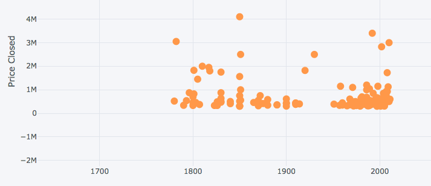
  * Assessment Value: strong indication and correlation
  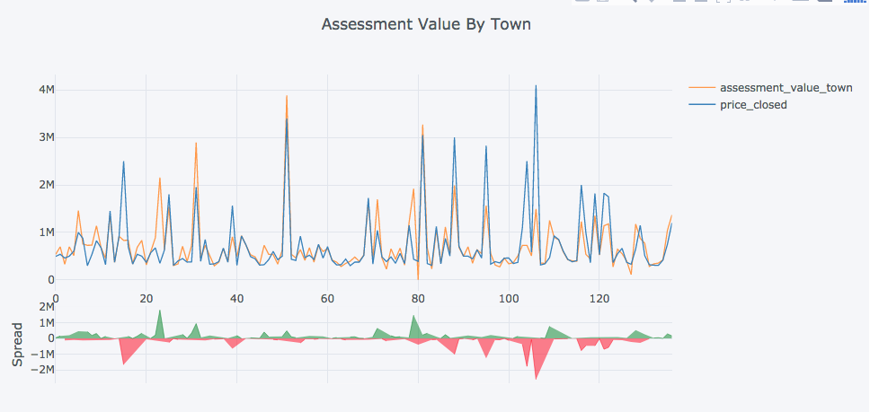
  * Square Feet Total: Strong linear correlation
  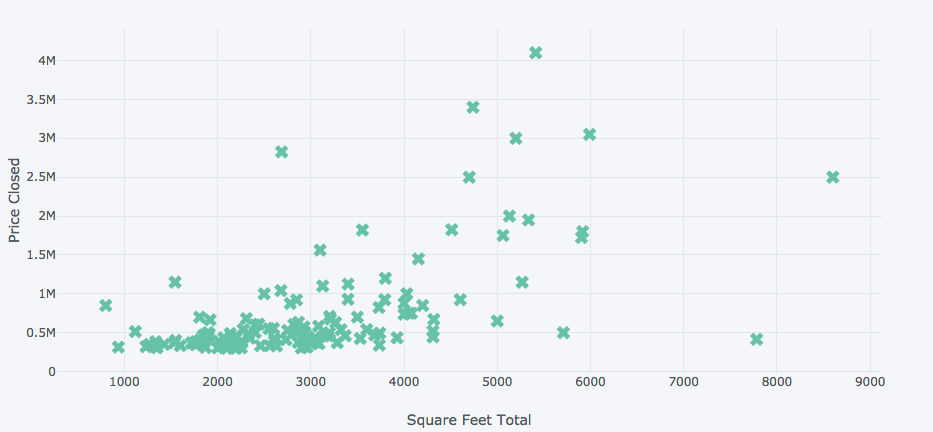
  * Acres: Somewhat linear correlated.
  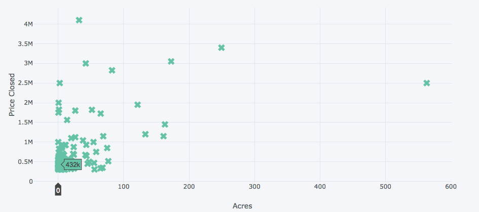
  * Tax Gross Amount: Resembles highly the distribution shape of our target response. Perhaps a strong correlation and thus highly useful features.
  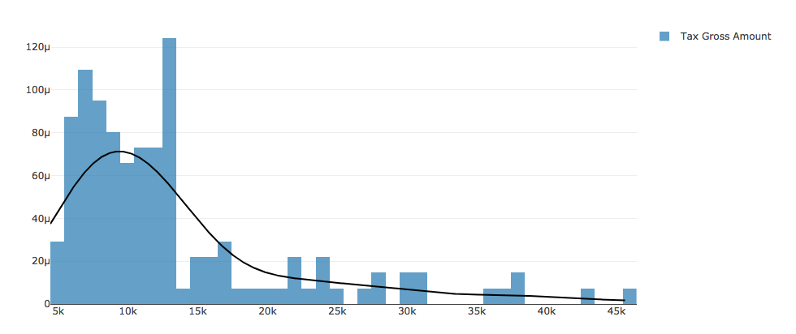
  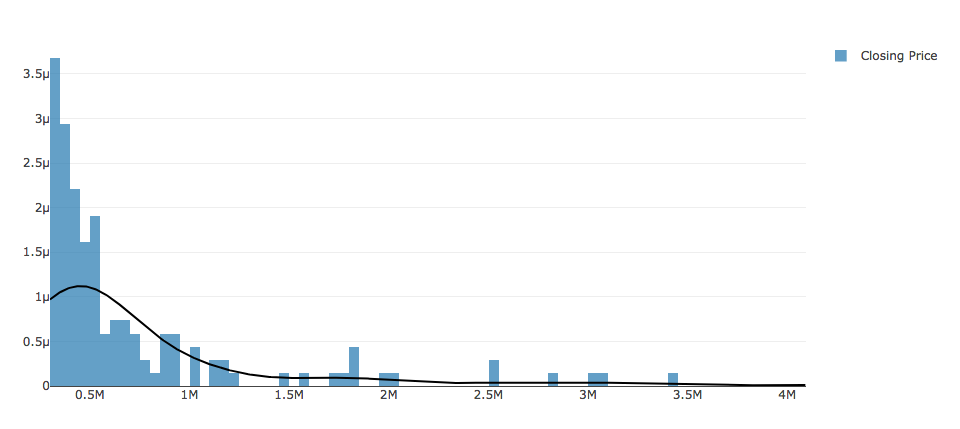

* Clustermap and heatmap is generated to confirm our evidence on correlation:
  * Seaborn superficial unsupervised ML tells us that they are highly segmented. This might pose a challenge for some of our models later, such as Random Forest Regressors due to multiple splits
  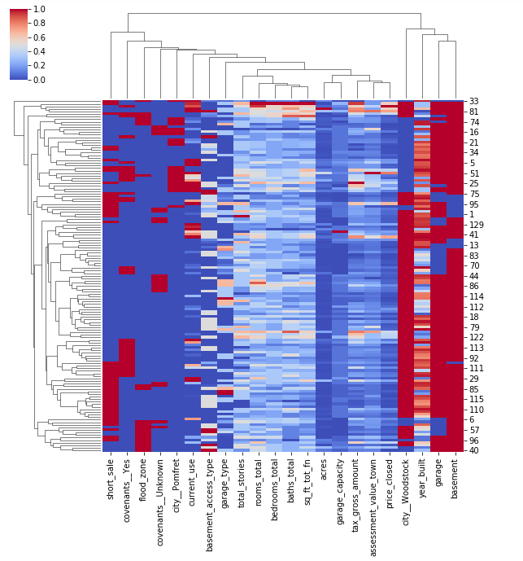
  * Masked heatmap on correlation matrix returns evidence on strongly correlated features, while indicating some sort of multi-collinearity between features as well
  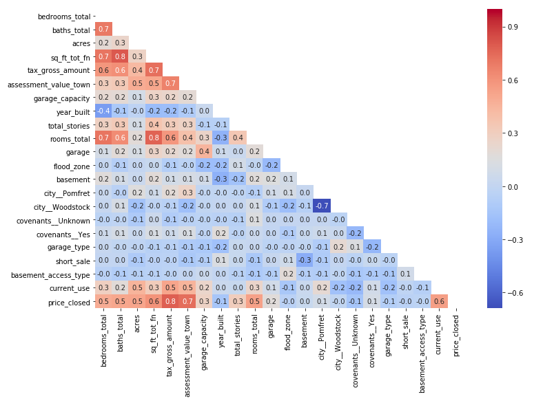

## Dimensional Reduction and Data Normalization: Exploring new models, improving old models
  * **Linear Regression** is run using newly engineered features, returned an improved result:

  `scores = cross_val_score(lm, X, y, cv=10,    scoring='neg_mean_squared_error')
   np.mean(np.sqrt(-scores))` RMSE == 421498.63610154501. This is an improvement from the preliminary steps
  * **Principal Component Analysis** is used to extract latent features and reduce noises. We also use Factor Analysis for cross reference of important features. It is evident that less PCA features could yield more accurate results
  ```python
  pca = decomposition.PCA()
  df_pca_full = pca.fit_transform(X)
  fa = decomposition.FactorAnalysis().fit(X)
  pd.DataFrame(fa.components_, columns=df_features.columns)
  pca = decomposition.PCA(n_components=9)
  df_pca = pca.fit_transform(X)
  scores = cross_val_score(lm, df_pca, y, cv=10, scoring='neg_mean_squared_error')
  np.mean(np.sqrt(-scores))
  ```
    * Additionally, the correlation heatmap also indicates strong colinearity between PCA features, once again indicates to us that logistic models may not work too well on our transformed dataset.
    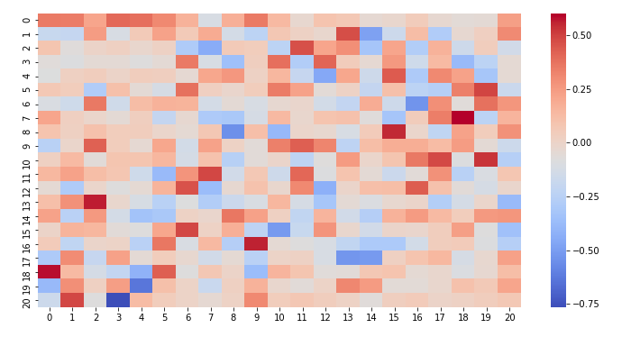

  * **Standard Scaler** and **Principal Component Analysis** are then experimented separately, then combined, to improve the performance of our linear regression model.
    * Our best `RMSE == 369202.472529`, significant improvement
    * Did not work as well on inverse transformation of PCA `RMSE == 372088.97`. So there is no need for that transformation for linear regression model

  * **Polynomial Feature** preprocessing is experimented at this step to confirm if it's necessary for that. It's not required since errors were higher

  * **Random Forest Regressor** is chosen for an alternative model due to its ability to make regression on ensembling. I am also interested in its ability to improve variance by averaging outcomes from multiple fully grown trees on variants of training set.
    * Since I have highly correlated features with my response, I am predicting an improved performance due to random subset of the features at each split, as well as bootstrapping my datasets with replacement, to improve selection and validation for my model
    * Simple loop and GridSearch CV is used to tune hypeparmeters of the model
    ```python
    estimator_range = range(10, 310, 10)
    RMSE_scores = []
    for estimator in estimator_range:
        rfreg = RandomForestRegressor(n_estimators=estimator, random_state=1)
        MSE_scores = cross_val_score(rfreg, X, y, cv=5, scoring='neg_mean_squared_error')
    RMSE_scores.append(np.mean(np.sqrt(-MSE_scores)))
    param_grid = {'rf__max_depth': [5,10,100,1000], 'rf__max_features': range(1,22)}
    pipeline = Pipeline([
        ('rf', RandomForestRegressor(n_estimators=40)),
    ])
    grid = GridSearchCV(pipeline, param_grid, cv=10, scoring='neg_mean_squared_error')
    grid.fit(X,y)
    print (grid.best_score_)
    print (grid.best_params_)
    ```
    * Model is fitted with best parameters, calculation of out-of-bag scores and features importance. Rerun on filtered features
    ```python
    print("Out of bag scores: ", rfg.oob_score_)
    print ("Out of bag R2 errors: ", 1-rfg.oob_score_ )
    sfm = SelectFromModel(rfg, threshold=0.01, prefit=True)
    X_important = sfm.transform(X)
    scores = cross_val_score(rfg, X_important, y, cv=10, scoring='neg_mean_squared_error')
    third = np.mean(np.sqrt(-scores))
    ```
    * This best model is cross valuated with same RFR model using PCA. PCA is significantly better and thus chosen to proceed. It also confirms our theory that there are a lot of noise in the dataset.
    ```python
    pca = decomposition.PCA(n_components=17)
    X_PCA =  pca.fit_transform(scaled_X)
    X_restored = pca.inverse_transform(X_PCA)
    rfg = RandomForestRegressor(max_depth=100, random_state=42,n_estimators=5)
    scores = cross_val_score(rfg, X_restored, y, cv=10, scoring='neg_mean_squared_error')
    np.mean(np.sqrt(-scores))
    ```
    * Although there is considerable improvement, RFR is prone to have overfitting issues as well as high variance. It might actually be worse off in predicting new data.
    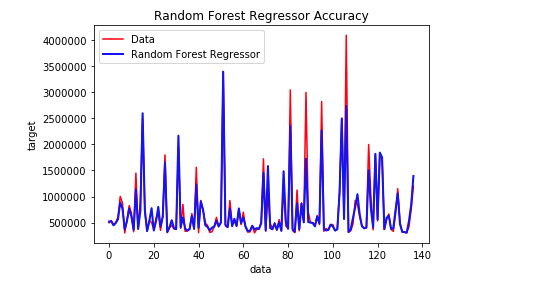

  * **Support Vector Regression(Linear)** is also chosen as a model. We can, however, see that there is a potential overfitting with low bias and high variance. It is evident from our visualization as well.
  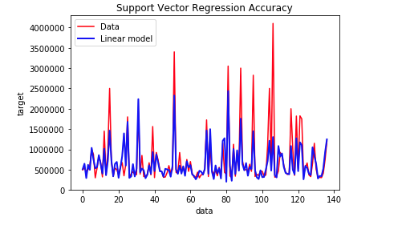
    * Stacking the estimators create a worse off result

  * **Prediction on test set**:
    * Simple Linear Regression is best performer with `RMSE == 352325.48`, PCA did not perform as well as expected
    * Random Forest Regressor does not do well with `RMSE == 424775.70`, this confirms our hypothesis about the overfitting models underperform.
    * Support Vector Regression, although takes the longest to train, is worst performer with `RMSE == 763346.11`
    * Complexity of the models thus adversely affect its performance

## Regularization
  * Overfitting, as evident from our experiments, is a great issue. Largely due to our small datasets and many parameters relatively to the amount of data. Some of our estimators are overtuned on the training data and thus were not giving good prediction.
  * Since we cannot obtain more data, we want to have a decent bias-variance tradeoff. Regularization is an approach that involves imposing a penalty on complex models. We want the least complex models to capture all the information in our data.
  * The data suffers from multicollinearity ( independent variables are highly correlated).This is actually applicable because the numbers of bedrooms will highly correlate with numbers of rooms, areas, thus tax values, etc...
  * We can proceed to experiment with models such as Ridge Regression, LASSO and Elastic Net. These estimators regularize by tweaking the coefficients of our model to prevent overfitting and reduce variance. Some bias will be introduced by default.
  * Using *scipy*, some of the coefficients are truly significant and can affect the target response tremendously. The data set has a positive skew which means it has a longer right tail, which was evident from our visualization. Kurtosis is high as well, indicating great peakedness, which was also confirmed from our visualization in steps above. Some of the t and p values of features like acres, square foot total... are also small, indicating why our linear regression was able to perform so well based on highly correlated features to have high probability and low errors. We can reject the null hypothesis of independence for those features.

## Regression, Ensemble and Stacking
  * We continue to explore PCA and scaling on LASSO, Ridge Regression and Elastic Net, using the same procedures as with the previous models.
    * The effect is minimal as the model itself already regularize the dataset.
  * Best performance model is Elastic Net, which combines the power of LASSO and Ridge Regression. `RMSE == 347195.12`
  * Manual Ensemble:
    * Using Object Oriented Programming,  TransformerMixin and Feature Union inheritance classes are created to aggregate the accuracy of all the model. By creating my custom class, I can also optimize model hyper parameters or pipeline. It can helps to save and load from this pre-trained models
    ```python
    class RidgeTransformer(Ridge,TransformerMixin):
    def __init__(self, model):
        self.model = model
    def fit(self, *args, **kwargs):
        self.model.fit(*args, **kwargs)
        return self
    def transform(self, X, **transform_params):
        return pd.DataFrame(self.model.predict(X))
    def ensemble_model():
        estimators = FeatureUnion(
          transformer_list=[
              ('ridge', RidgeTransformer(Ridge(normalize=True,lpha=1e-10))),
              ('lasso', LassoTransformer(Lasso(normalize=True,alpha=0.0001))),
              ('linear',LinearRegressionTransformer(LinearRegression(normalize=True)))
          ])
        ensemble = Pipeline([
          ('scaler', StandardScaler()),
          ('estimators', estimators),
          ('elastic',ElasticNet(normalize=True,alpha=1e-3,selection='random',l1_ratio=0.7))
      ])
      return ensemble
    ```
    * The Machine Learning Extension Library is also utilized to create a more sophisticated stacking of different regression models:
    ```python
    estimators = []
    model1 = LinearRegression(normalize=True)
    estimators.append(model1)
    model2 = Lasso(normalize=True,alpha=0.0001)
    estimators.append(model2)
    model3 = Ridge(normalize=True,alpha=1e-10)
    estimators.append(model3)
    model4 = ElasticNet(normalize=True,alpha=1e-3,selection='random',l1_ratio=0.7)
    estimators.append(model4)
    svr_rbf = SVR(kernel='linear')
    stregr = StackingRegressor(regressors=estimators, meta_regressor=svr_rbf)
    stregr.fit(X, y)
    results = cross_val_score(stregr, X, y, cv=10, scoring='neg_mean_squared_error')
    np.mean(np.sqrt(-results))
    ```
    * The result is an improved performance in our testing prediction: We can therefore conclude that the issue of overfitting has been reduced.
      * `RMSE Manual Ensemble == 348585.29`
      * `RMSE Stacking Regressor == 368604.82`

## Real Time Prediction and Conclusion
* Attempting to predict closing prices of current properties on the market using models we created. The actual price is obtain from the Internet from websites such as realtor.com, zillow.com, etc...
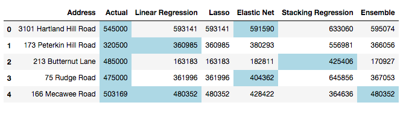
* Some models work better than others, Elastic Net seems to be the best performing one of all
* Linear Regression, Ridge and Lasso follows each other really closely
* Stacking Regression is more accurate for large real estate values
* Although there are errors, they are within the RMSE range, so this is an positive sign to continue fine tuning our models
* We did not include the most updated values, as well as accounting for the changes in time
* A lot of the listings do not have information available on the Internet

## Next step
* Further feature engineering
* Much more data is needed
* Enhance model's performance by fine tuning stacking and ensemble
* Explore boosting to reduce the overfitting issues of Random Forest Regressor, SVG, etc...
* Explore PCA of only important features in Random Forest Regressor
* Hyper parameter tuning for Elastic Net
