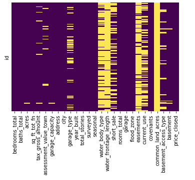
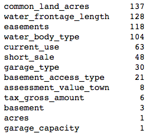
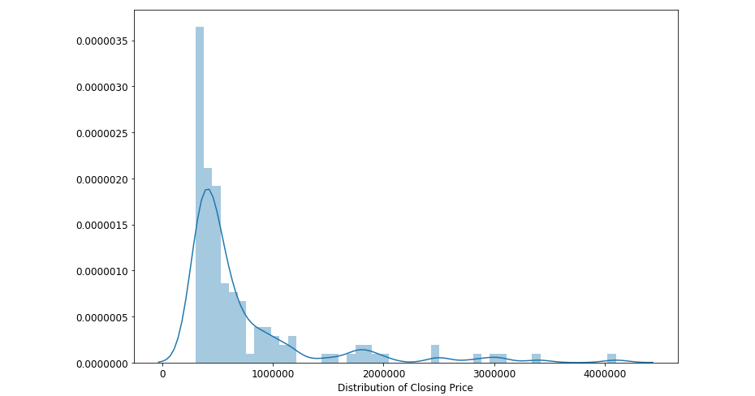
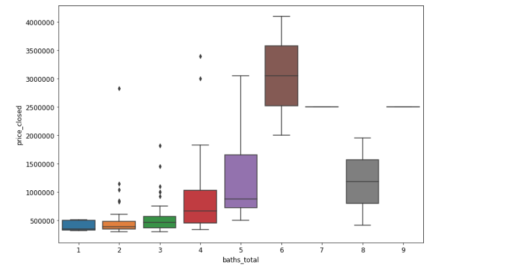
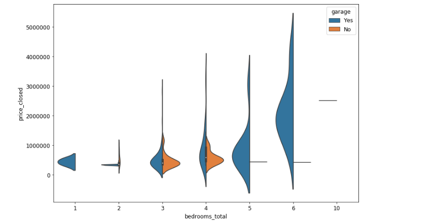
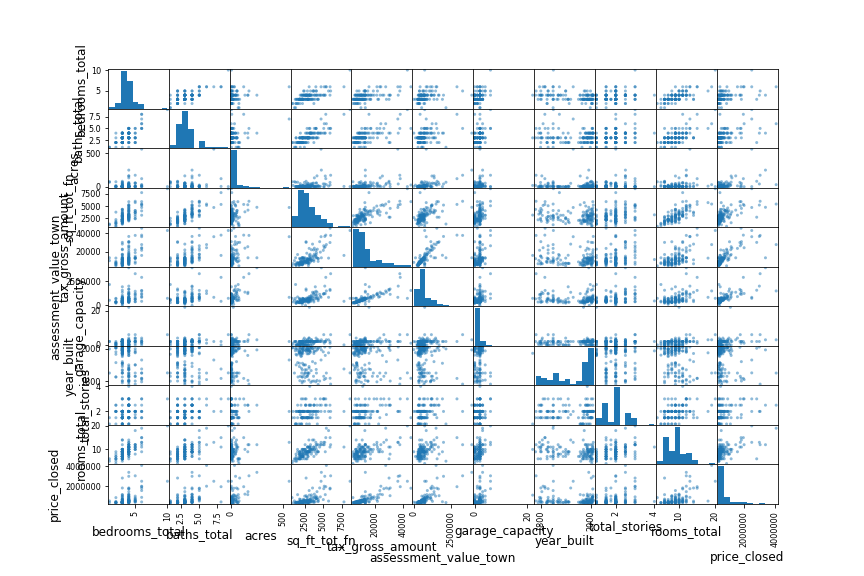
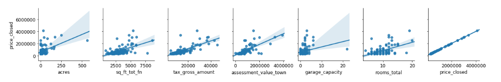
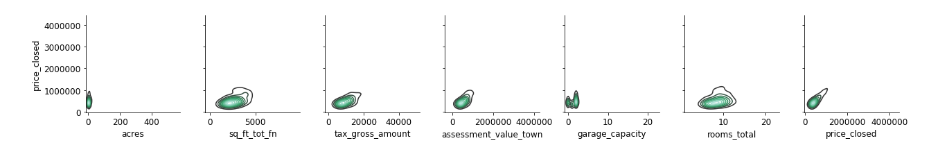
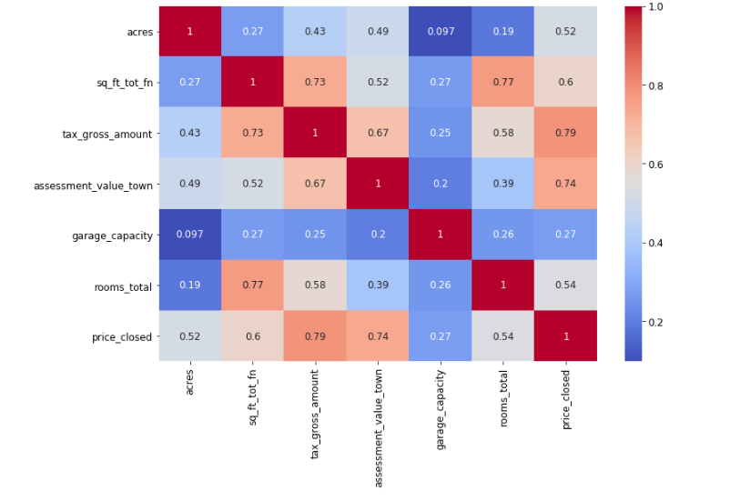
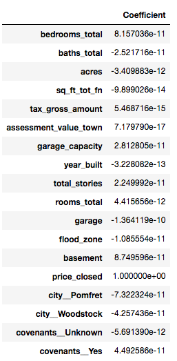

# Capstone project: REAL ESTATE PRICE PREDICTION

## Context

A local Vermont/New Hampshire real estate firm is looking into modeling closed prices for houses. This dataset contains features of houses in three towns in Vermont, which make up a sizable chunk of the real estate firm's business.

## Hypothesis

Is it possible to predict a closing price of a property in Vermont/New Hampshire with

## Data
| Training Data       | Testing Data           | Validating Data  |
| :-------------: |:-------------:| :-----:|
| train.csv      | test.csv | validate.csv |

* Data was obtained from Kaggle.com
  * This dataset contains features of houses in three towns in Vermont,
which make up a sizable chunk of the real estate firm's business.
  * MLS.com is the real estate information platform that is publicly available. Features were exported from an MLS web platform. (Perhaps webscraping)

## Features:
* `id` : Numeric
* `bedrooms_total` : Numeric
* `baths_total` : Numeric
* `acres` : Numeric
* `sq_ft_tot_fn` : Numeric
* `tax_gross_amount` : Numeric
* `assessment_value_town` : Numeric
* `garage_capacity` : Numeric
* `address` : String
* `city` : String
* `garage_type` : String
* `year_built` : Numeric
* `total_stories` : Numeric
* `surveyed` : String
* `seasonal` : String
* `water_body_type` : String
* `water_frontage_length` : Numeric
* `short_sale` : String
* `rooms_total` : Numeric
* `garage` : String
* `flood_zone` : String
* `easements` : String
* `current_use` : String
* `covenants` : String
* `common_land_acres` : String
* `basement_access_type` : String
* `basement` : String
* `price_closed`: String

## Technology
* Jupyter Notebook
* Python

## Python libraries
* scikit-learn (for topic modeling)
* pandas (for data science)
* numpy (for general numerics and linear algebra)
* TensorFlow,Contrib.Learn(for neural network analysis)

## Data Munging and Exploration

* First, the dataframe is queried for null values using `df.isnull().sum().sort_values(ascending=False)`

* Null values are then visualized using a heatmap `sns.heatmap(df.isnull(),yticklabels=False,cbar=False,cmap='viridis')`

* Since the data sample is small, I have decided to drop columns that have null values more than 60% such as
  * common_land_acres
  * water_frontage_length
  * easements
  * water_body_type

* Thus, Dataframe is first munged using `df = df.drop(['common_land_acres','water_frontage_length','easements','water_body_type'],axis=1)`

* For some other columns, I have decided to fill in the missing values with the mean of those columns iteratively
 * `for col in ['acres','garage_capacity','tax_gross_amount','assessment_value_town']:
    df[col] = df[col].fillna(df[col].mean())`

* For column that have only a few missing values, I use my best judgement to fill in values that could potentially help to create a reasonable values and will not affect the distribution. Mapping to a dictionary was used in some cases
   * `df['basement'] = df['basement'].fillna('No')`
   * `df['flood_zone']= df['flood_zone'].map({'No':0,'Yes':1,'Unknown':1})`
   * `df['current_use']= df['current_use'].map({'No':0,'Yes':1,'Unknown':1})`
   * `df['basement']= df['basement'].map({'No':0,'Yes':1})`
   * `df['garage']= df['garage'].map({'No':0,'Yes':1})`

* At this stage, some dummies column values are generated as part of exploratory feature engineering
  * `city = pd.get_dummies(df.city,prefix='city_',drop_first=True)`
  * `covenants = pd.get_dummies(df.covenants,prefix='covenants_',drop_first=True)`

## Visualization: Exploratory Data Analysis
* Methods such as `info()` and `describe` are called on the dataframe for analysis
* A visualiztion of the closing price distribution is necessary to shape our methodology. It is normally distributed with a long tail
 
* We can also see a clear distinction between closing prices differe by number of bedrooms and bathrooms
  
  
* Perhaps the bedroom price is also different based on the fact whether or not a property has a garage?
  
* A scatter matrix is created with Seaborn to visualize the relationship within all existing features:
 
* Upon inspection, we can see some clear linear features. Re-visualize them with Seaborn and focus on the *'Closing Price'* row
 
 * We also take a look at the relationships that are not linear:
  
* A Seaborn heatmap is neccessary to show the correlation between features
  

## Simple Linear Regression
* Firstly, I attempted to train the model on the testing dataset using train_test_split
  * `X = df[['bedrooms_total', 'baths_total', 'acres', 'sq_ft_tot_fn',
       'tax_gross_amount', 'assessment_value_town', 'garage_capacity',
       'year_built', 'total_stories',
       'rooms_total', 'garage',
       'flood_zone',
       'basement', 'price_closed', 'city__Pomfret', 'city__Woodstock',
       'covenants__Unknown', 'covenants__Yes']]`
  * `y = df['price_closed']`
* A simple linear regression model is intialized and trained
  * `X_train,X_test,y_train,y_test= train_test_split(X,y,test_size=0.2,random_state=101)
from sklearn.linear_model import LinearRegression
lm = LinearRegression()
lm.fit(X_train,y_train)`

* Metrics such as mean absolute errors, mean squared errors and root mean squared errors are used to evaluate this first run:
  * MAE: 3.6795557077441895e-10
  * MSE: 3.626511061315912e-19
  * RMSE: 6.02205202677286e-10

* The coefficients value of each features are also generated for evaluation
 * `lm.coef_
df=pd.DataFrame(lm.coef_,X.columns,columns=['Coefficient'])`

* The accuracy of the model is then cross-evaluated with the null accuracy of the model itself
  * `y_null = np.zeros_like(y_test, dtype=float)
y_null.fill(y_test.mean())
np.sqrt(metrics.mean_squared_error(y_test, y_null))` == 649444.99460724776 (understandable due to large discrepancies between housing prices, that are in the million range)

* The model is run again, this time with cross validation(number of folds = 10)
  * `from sklearn.cross_validation import cross_val_score
mse_scores = cross_val_score(lm, X, y, cv=10, scoring='neg_mean_squared_error')
print ((-mse_scores).mean())`

## Conclustion:
* At this stage, more evaluation and data exploration is needed.
* Since the sample size is small, the goal is to get the error margin to be as close to zero as possible
* Next step: Dimensionality reduction, Deep Learning, Random Forest Regressor
