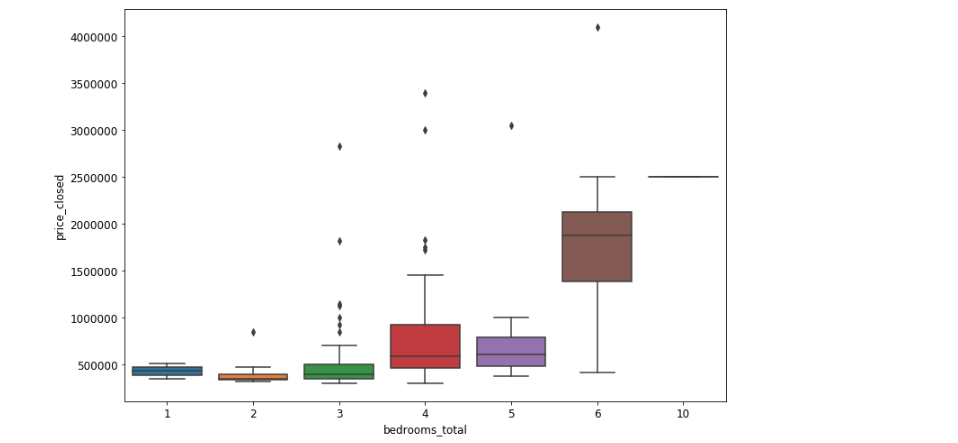

# Capstone project: REAL ESTATE PRICE PREDICTION

## Context

A local Vermont/New Hampshire real estate firm is looking into modeling closed prices for houses. This dataset contains features of houses in three towns in Vermont, which make up a sizable chunk of the real estate firm's business.

## Hypothesis

Is it possible to predict a closing price of a property in Vermont/New Hampshire with machine learning algorithm? If so, how accurate can it be?

## Data
| Training Data       | Testing Data           | Validating Data  |
| :-------------: |:-------------:| :-----:|
| train.csv      | test.csv | validate.csv |

* Data was obtained from Kaggle.com
  * This dataset contains features of houses in three towns in Vermont,
which make up a sizable chunk of the real estate firm's business.
  * MLS.com is the real estate information platform that is publicly available. Features were exported from an MLS web platform. (Perhaps webscraping)

## Features:
* `id` : Numeric
* `bedrooms_total` : Numeric
* `baths_total` : Numeric
* `acres` : Numeric
* `sq_ft_tot_fn` : Numeric
* `tax_gross_amount` : Numeric
* `assessment_value_town` : Numeric
* `garage_capacity` : Numeric
* `address` : String
* `city` : String
* `garage_type` : String
* `year_built` : Numeric
* `total_stories` : Numeric
* `surveyed` : String
* `seasonal` : String
* `water_body_type` : String
* `water_frontage_length` : Numeric
* `short_sale` : String
* `rooms_total` : Numeric
* `garage` : String
* `flood_zone` : String
* `easements` : String
* `current_use` : String
* `covenants` : String
* `common_land_acres` : String
* `basement_access_type` : String
* `basement` : String
* `price_closed`: String

## Technology
* Jupyter Notebook
* Python

## Python libraries
* scikit-learn (for topic modeling)
* pandas (for data science)
* numpy (for general numerics and linear algebra)
* MLxtend (for stacking regression)
* Seaborn, Plotly (for visualization)
* TensorFlow,Contrib.Learn(for neural network analysis)

## Data Munging and Exploration

* First, the dataframe is queried for null values using `df.isnull().sum().sort_values(ascending=False)`

* Null values are then visualized using a heatmap `sns.heatmap(df.isnull(),yticklabels=False,cbar=False,cmap='viridis')`


* Since the data sample is small, I have decided to drop columns that have null values more than 60% such as
  * common_land_acres
  * water_frontage_length
  * easements
  * water_body_type


* Thus, Dataframe is first munged using `df = df.drop(['common_land_acres','water_frontage_length','easements','water_body_type'],axis=1)`

* For some other columns, I have decided to fill in the missing values with the mean of those columns iteratively


```python
for col in ['acres','garage_capacity','tax_gross_amount','assessment_value_town']:
  df[col] = df[col].fillna(df[col].mean())
```

* For column that have only a few missing values, I use my best judgement to fill in values that could potentially help to create a reasonable values and will not affect the distribution. Mapping to a dictionary was used in some cases
   * `df['basement'] = df['basement'].fillna('No')`
   * `df['flood_zone']= df['flood_zone'].map({'No':0,'Yes':1,'Unknown':1})`
   * `df['current_use']= df['current_use'].map({'No':0,'Yes':1,'Unknown':1})`
   * `df['basement']= df['basement'].map({'No':0,'Yes':1})`
   * `df['garage']= df['garage'].map({'No':0,'Yes':1})`

* At this stage, some dummies column values are generated as part of exploratory feature engineering
  * `city = pd.get_dummies(df.city,prefix='city_',drop_first=True)`
  * `covenants = pd.get_dummies(df.covenants,prefix='covenants_',drop_first=True)`

## Visualization: Exploratory Data Analysis
* Methods such as `info()` and `describe` are called on the dataframe for analysis
* A visualiztion of the closing price distribution is necessary to shape our methodology. It is normally distributed with a long tail
 
* We can also see a clear distinction between closing prices differe by number of bedrooms and bathrooms
  
  
* Perhaps the bedroom price is also different based on the fact whether or not a property has a garage?
  
* A scatter matrix is created with Seaborn to visualize the relationship within all existing features:
 
* Upon inspection, we can see some clear linear features. Re-visualize them with Seaborn and focus on the *'Closing Price'* row
 
 * We also take a look at the relationships that are not linear:
  
* A Seaborn heatmap is neccessary to show the correlation between features
  

## Simple Linear Regression
* Firstly, I attempted to train the model on the testing dataset using train_test_split

```python
X = df[['bedrooms_total', 'baths_total', 'acres',    'sq_ft_tot_fn','tax_gross_amount', 'assessment_value_town', 'garage_capacity','year_built', 'total_stories',
'rooms_total', 'garage','flood_zone','basement', 'price_closed', 'city__Pomfret', 'city__Woodstock',
'covenants__Unknown', 'covenants__Yes']]
y = df['price_closed']
```

* A simple linear regression model is intialized and trained

```python
X_train,X_test,y_train,y_test= train_test_split(X,y,test_size=0.2,random_state=101)
from sklearn.linear_model import LinearRegression
lm = LinearRegression()
lm.fit(X_train,y_train)
```

* Metrics such as mean absolute errors, mean squared errors and root mean squared errors are used to evaluate this first run:
  * MAE: 314120.6155993199
  * MSE: 262121390014.01596
  * RMSE: 511977.9194594392

* The coefficients value of each features are also generated for evaluation

```python
df=pd.DataFrame(lm.coef_,X.columns,columns=['Coefficient'])
```


* The accuracy of the model is then cross-evaluated with the null accuracy of the model itself

```python
y_null = np.zeros_like(y_test, dtype=float)
y_null.fill(y_test.mean())
np.sqrt(metrics.mean_squared_error(y_test, y_null))
```
Null Accura
cy == 649444.99460724776 (understandable due to large discrepancies between housing prices, that are in the million range)

* The model is run again, this time with cross validation(number of folds = 10)

```python
from sklearn.cross_validation import cross_val_score
mse_scores = cross_val_score(lm, X, y, cv=10, scoring='neg_mean_squared_error')
print (np.sqrt(-mse_scores).mean())
```
RMSE == 451590.943238. We need to improve this score!

## Further Data Munging and Feature Engineering
* In order to create a more conclusive result and improve our error, the datasets need to be more complete. K Nearest Neighbors estimator is used to impute values for missing values using their closest 5 neighbor rows:
  * Mapping is also used on some of the smaller missing values on features. This process will be incorporated into cleaning the testing data later on.
  ```python
  df['garage_type']= df['garage_type'].map({'Attached':0,'Detached':1,'Under':2,'Carport':3})
  df['short_sale']=np.where(df['short_sale']=='No', 0, 1)
  df['basement_access_type']= df['basement_access_type'].map({'Interior':0,'Walkout':1,'Walk-up':2})
  X_filled_knn = KNN(k=5).complete(X)
  ```
  * Clean dataset is exported out to be used in the next step:
  `cleaned_csv.to_csv('../data/train_clean.csv', index=False)`

  * Entire process from preliminary and current step is repeated on the testing set to be used for validation later

* Plotly is used to create interactive plots to understand more about the dataset and to examine outliers
  * Year built: outliers and cluster
  
  * Assessment Value: strong indication and correlation
  
  * Square Feet Total: Strong linear correlation
  
  * Acres: Somewhat linear correlated.
  
  * Tax Gross Amount: Resembles highly the distribution shape of our target response. Perhaps a strong correlation and thus highly useful features.
  
  

* Clustermap and heatmap is generated to confirm our evidence on correlation:
  * Seaborn superficial unsupervised ML tells us that they are highly segmented. This might pose a challenge for some of our models later, such as Random Forest Regressors due to multiple splits
  
  * Masked heatmap on correlation matrix returns evidence on strongly correlated features, while indicating some sort of multi-collinearity between features as well
  

## Exploring new models, improving old models
  * **Linear Regression** is run using newly engineered features, returned an improved result:

  `scores = cross_val_score(lm, X, y, cv=10,    scoring='neg_mean_squared_error')

   np.mean(np.sqrt(-scores))` RMSE == 421498.63610154501. This is an improvement from the preliminary steps
  * **Principal Component Analysis** is used to extract latent features and reduce noises. We also use Factor Analysis for cross reference of important features. It is evident that less PCA features could yield more accurate results
  ```python
  pca = decomposition.PCA()
  df_pca_full = pca.fit_transform(X)
  fa = decomposition.FactorAnalysis().fit(X)
  pd.DataFrame(fa.components_, columns=df_features.columns)
  pca = decomposition.PCA(n_components=9)
  df_pca = pca.fit_transform(X)
  scores = cross_val_score(lm, df_pca, y, cv=10, scoring='neg_mean_squared_error')
  np.mean(np.sqrt(-scores))
  ```
    * Additionally, the correlation heatmap also indicates strong colinearity between PCA features, once again indicates to us that logistic models may not work too well on our transformed dataset.
    

  * **Standard Scaler** and **Principal Component Analysis** are then experimented separately, then combined, to improve the performance of our linear regression model.
    * Our best `RMSE == 369202.472529`, significant improvement
    * Did not work as well on inverse transformation of PCA `RMSE == 372088.97`. So there is no need for that transformation for linear regression model

  * **Polynomial Feature** preprocessing is experimented at this step to confirm if it's necessary for that. It's not required since errors were higher


## Conclusion:
* At this stage, more evaluation and data exploration is needed.
* Since the sample size is small, the goal is to get the error margin to be as close to zero as possible
* Next step: Dimensionality reduction, Deep Learning, Random Forest Regressor
